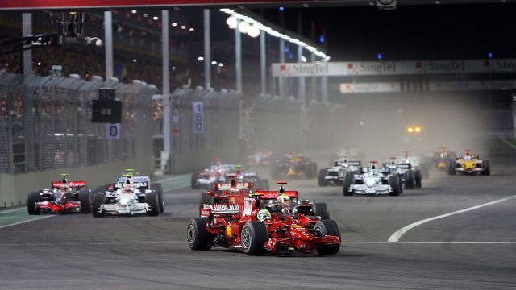

# :car: Formula 1 Racing Prediction

### :green_book: DESCRIPTION
This repository shows an exploratory and predictive analysis of Formula 1 Racing Winners and sports betting simulation.

---
### :computer: TOOLS
`Python` `Pandas` `NumPy` `scikit-learn` `Seaborn` `Tableau`

---
### :page_with_curl: CREDITS
- [Photo](https://www.formula1.com/en/latest/features/2015/9/do-you-remember----f1s-first-ever-night-race.html)
- [Dataset](https://www.kaggle.com/datasets/rohanrao/formula-1-world-championship-1950-2020)
- [Related works](https://towardsdatascience.com/formula-1-race-predictor-5d4bfae887da)
